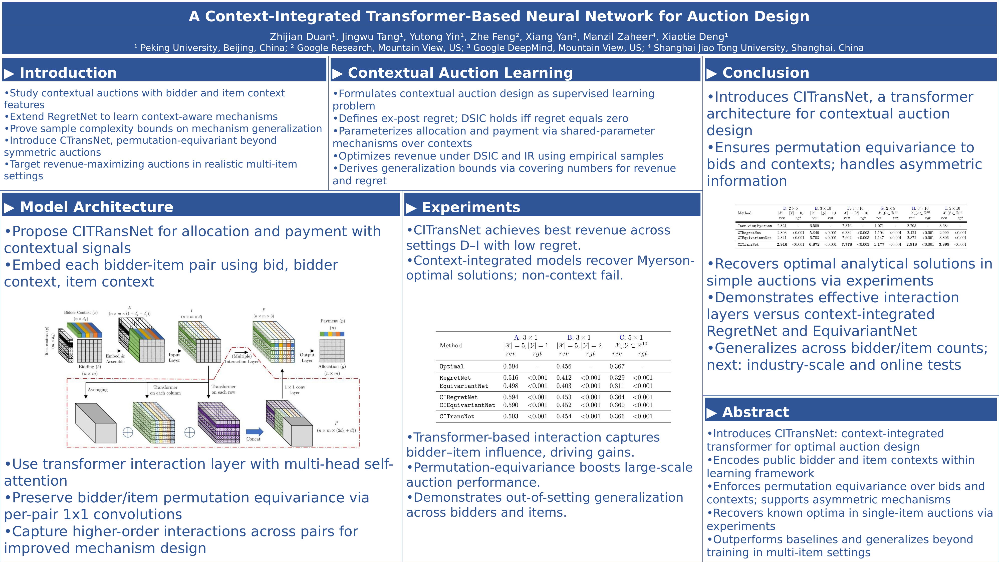
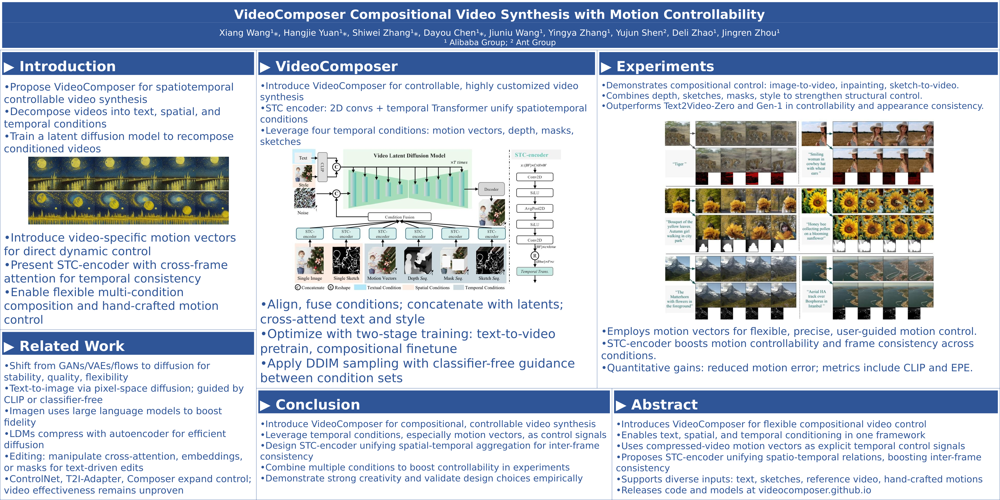

# Poster Generation User Guide

This project aims to automatically generate academic posters from research papers. The main workflow includes: data preprocessing → bullet point generation → poster generation.

---

## 1. Environment Setup

### Install Dependencies

Install Python dependencies:

```bash
pip install -r requirements.txt
```

Install LibreOffice (required for document conversion):

```bash
sudo apt install libreoffice
```

---

## 2. Data Preparation

### 1. Download and Process Dataset

Download the Paper2Poster dataset and process it using **MinerU**.

After processing, the directory structure should be:

```text
paper2poster/
└── parsed_papers/
    └── {paper_id}/
        ├── {paper_id}.pdf
        └── poster.png
```

Where:

* `{paper_id}.pdf`: Original research paper
* `poster.png`: Corresponding reference poster image

---

### 2. Prepare Assets

Download the following directory from the original Paper2Poster repository:

```text
assets/poster_data
```

Copy it into this project:

```text
paper2poster/assets/poster_data
```

Make sure the directory structure is consistent, otherwise template or style loading may fail.

---

## 3. Bullet Point Generation

Bullet points summarize key information from papers and serve as intermediate results for poster generation.

### 1. Configure API Key

This project uses Alibaba Cloud DashScope API by default. Please set the environment variable first:

```bash
export DASHSCOPE_API_KEY=your_api_key
```

Replace `your_api_key` with your actual API key.

---

### 2. Run Bullet Generation Script

Execute the following command:

```bash
python gen_bullet.py \
  --summ_provider aliyun \
  --summ_model qwen3-vl-8b-instruct \
  --gpu_id 0 \
  --poster_path /path/to/parsed_papers/{paper_id} \
  --output_root ./bullet_output
```

Parameter description:

* `--summ_provider`: Model service provider (default: aliyun)
* `--summ_model`: Model name
* `--gpu_id`: GPU device ID
* `--poster_path`: Input paper directory path
* `--output_root`: Output directory for bullet points

Generated results will be saved in:

```text
./bullet_output/
```

---

## 4. Poster Generation

After obtaining bullet points, you can generate the final poster.

Run the following command:

```bash
python gen_poster.py \
  --input_dir ./bullet_output \
  --output_dir ./poster_output
```

Parameter description:

* `--input_dir`: Bullet output directory
* `--output_dir`: Final poster output directory

Results will be saved in:

```text
./poster_output/
```

---

## 5. Complete Workflow Example

Example of a full pipeline:

```bash
# 1. Install dependencies
pip install -r requirements.txt
sudo apt install libreoffice

# 2. Set API key
export DASHSCOPE_API_KEY=your_api_key

# 3. Generate bullet points
python gen_bullet.py \
  --summ_provider aliyun \
  --summ_model qwen3-vl-8b-instruct \
  --gpu_id 0 \
  --poster_path ./parsed_papers/xxxx \
  --output_root ./bullet_output

# 4. Generate poster
python gen_poster.py \
  --input_dir ./bullet_output \
  --output_dir ./poster_output
```

---

## 6. Notes

1. Make sure the `parsed_papers` directory structure is correct, otherwise the program may fail.
2. Ensure your API key is valid and has sufficient quota.
3. If GPU resources are limited, set `--gpu_id` to `-1` to use CPU (if supported).
4. Linux environment is recommended for better compatibility with LibreOffice and dependencies.


## 7. Examples

Below are example posters generated by our framework, along with the corresponding paper titles and links.

### **A Context-Integrated Transformer-Based Neural Network for Auction Design**

[Paper Link](https://arxiv.org/abs/2201.12489)



---

### **Flexible Attention-Based Multi-Policy Fusion for Efficient Deep Reinforcement Learning**

[Paper Link](https://proceedings.neurips.cc/paper_files/paper/2023/hash/2c23b3c72127e15fedc276722faee927-Abstract-Conference.html)


---

### **InfinityGAN: Towards Infinite-Pixel Image Synthesis**

[Paper Link](https://arxiv.org/abs/2104.03963)


---

### **VideoComposer: Compositional Video Synthesis with Motion Controllability**

[Paper Link](https://arxiv.org/abs/2306.02018)



---

### **Visual Correspondence Hallucination**

[Paper Link](https://arxiv.org/abs/2106.09711)


